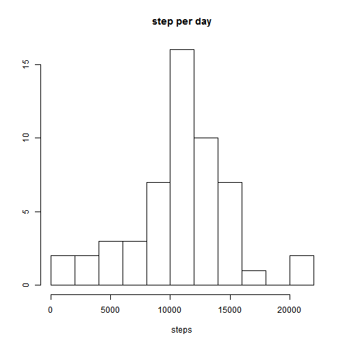
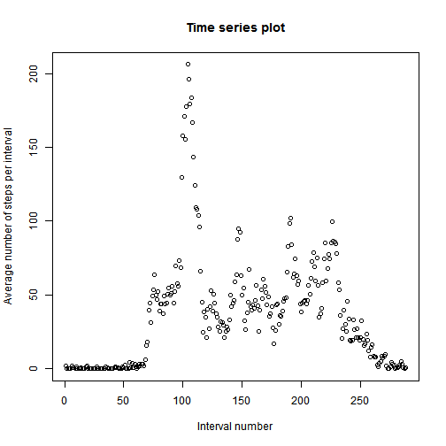
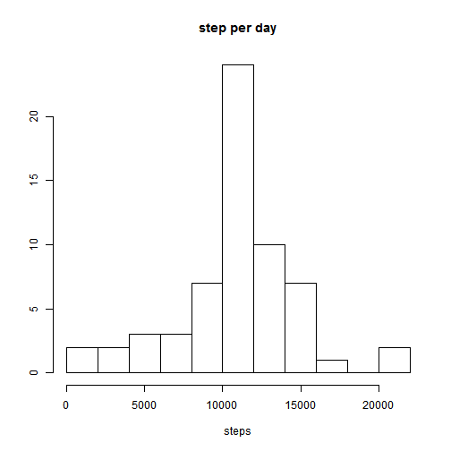
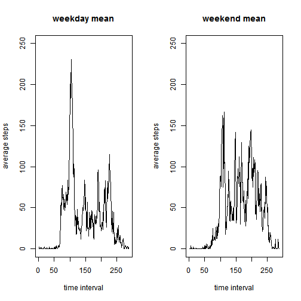

##Reproducible Research - Peer Assessment 1  

###Loading and preprocessing the data  
Data from a personal activity monitoring device. This device collects data at 5 minute intervals through out the day. The data consists of two months of data from an anonymous individual

Download, load and processing data

```r
url<-"https://d396qusza40orc.cloudfront.net/repdata%2Fdata%2Factivity.zip"
download.file(url,destfile="Activity.zip",method="curl")
ActivityData<-read.csv(unz("Activity.zip","activity.csv"))
ActivityData$interval<-as.factor(ActivityData$interval)
```
 
###What is mean total number of steps taken per day?
calculates the total number of steps per day and shows a histogram of the result

```r
StepsPerDay<-tapply(ActivityData$steps,ActivityData$date,sum)
hist(StepsPerDay,main="step per day", xlab="steps",ylab="",breaks=10)
```

 

The mean and median number of steps per day

```r
stepsMean<-mean(StepsPerDay,na.rm=TRUE)
stepsMedian<-median(StepsPerDay,na.rm=TRUE)
```

Per each day there are on avverage 10766 steps and the median number of steps is 10765   

###What is the average daily activity pattern?

Calculate the mean steps per interval and shows plot

```r
meanPerInterval<-tapply(ActivityData$steps,ActivityData$interval,mean,na.rm=TRUE)
plot(1:length(meanPerInterval),meanPerInterval,xlab="Interval number", ylab="Average number of steps per interval",main="Time series plot")
walkTime<-names(meanPerInterval[meanPerInterval==max(meanPerInterval)])
```

 

On the interval of: 835 there is, on avverage, the maximal number of steps along the day.

###Imputing missing values
Calculate the number of missing values

```r
MissingSteps<-is.na(ActivityData$steps)
NA.no<-sum(MissingSteps)
```

There are 2304 missing values in the 'steps' column. 

We will fill the missing values with the rounded average number of steps that propriate for the missing interval, In new data set called 'Activity2'. 

```r
Activity2<-ActivityData
Activity2$steps[MissingSteps]<-rep(round(meanPerInterval),61)[MissingSteps]
```

calculate the total number of steps per day , for the new data set,and shows a histogram of the result.

```r
StepsPerDay2<-tapply(Activity2$steps,Activity2$date,sum)
hist(StepsPerDay2,main="step per day", xlab="steps",ylab="",breaks=10)
```

 

```r
stepsMean2<-as.character(round(mean(StepsPerDay2,na.rm=TRUE)))
stepsMedian2<-as.character(round(median(StepsPerDay2,na.rm=TRUE)))
```


Per each day there are on average 10766 steps and the median number of steps is 10762.
Before filling the missing data there were on avverage 10766 steps and the median number od steps is 10765.
 
###Are there differences in activity patterns between weekdays and weekends?

Creates a new factor variable in the dataset with two levels – “weekday” and “weekend”

```r
Sys.setlocale("LC_TIME", "English")
Activity2$day<-weekdays(strptime(Activity2$date,"%Y-%m-%d"))
Activity2$day<-as.factor(Activity2$day=="Saturday"|Activity2$day=="Sunday")
levels(Activity2$day)<-c("weekday","weekend")
```

Calculates the mean steps per interval and shows plot

```r
meanIntervalDay<-tapply(Activity2$steps,list(Activity2$interval,Activity2$day),mean)
par(mfrow=c(1,2))
plot(1:length(meanIntervalDay[,1]),meanIntervalDay[,1],type="l",main="weekday mean",xlab="time interval",ylab="average steps",ylim=range(c(0,250)))
plot(1:length(meanIntervalDay[,1]),meanIntervalDay[,2],type="l",main="weekend mean",xlab="time interval",ylab="average steps",ylim=range(c(0,250)))
```

 
